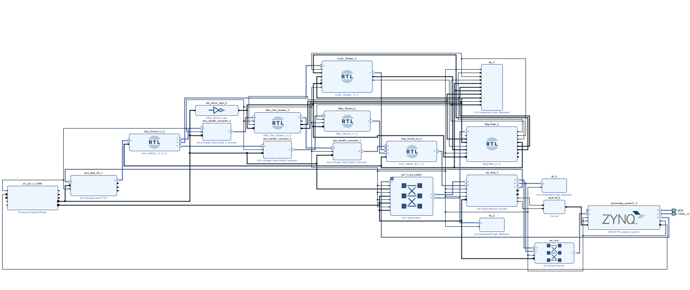

低延时低功耗的星敏感器算法FPGA实现
================================
该工程都是通过SpianlHDL编写
---------------------------
设计了一种基于FPGA的低延时低功耗的星敏感器算法,该算法包括图像去噪预处理，星点提取和星图识别三部分。图像预处理完成了对图像背景的抑制，减少非均匀背景对星图的影响。其次，星点提取仅对图像进行了一次扫描，极大提高了系统的输出频率，满足了实时性的要求。最后，星图识别算法包括三角形构建和三角形识别两部分，通过构建的三角形与星库数据对比完成识别。

工程的BD
--------------------
 

目录介绍  
---------------------------
condomain：连通域代码  
MedFilter：中值滤波的数据准备  
Sort：中值滤波排序模块，并行实现了50个点取中值  
Regtable：寄存器表  

